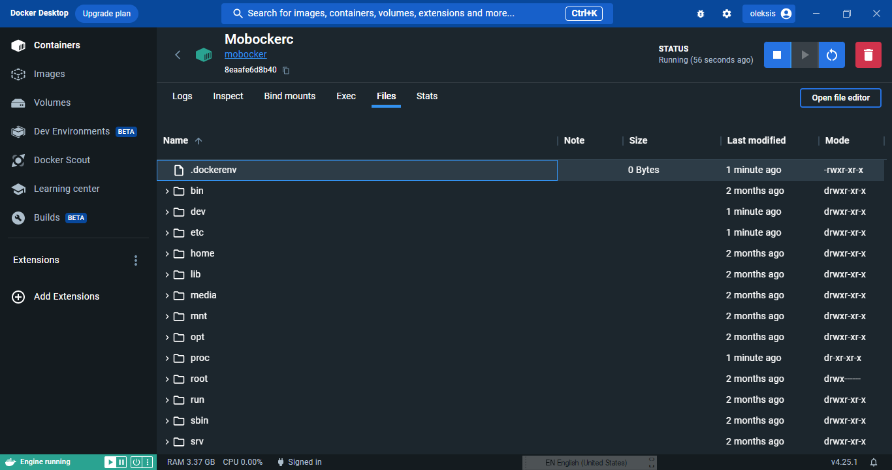

# Mobocker

[](https://opensource.org/licenses/MIT)

The dummest container, is the smaller running container to keep Docker daemon alive.



## Steps

- To keep the docker daemon service running infinity.
- Keep the docker enginge in "Resource Saver mode" disabled.
- If Docker Desktop GUI keep the status "Engine running" mode all work as expected.
- When the dockerd service in Windows is in "Resource Saver mode" enabled automatically stopping the Docker Desktop Linux VM when no containers are running for a period of time by default 5 mins.
- If "Resource Saver mode" is on the Docker Desktop GUI crash and closes unexpectedly

## How to use

```bash
# docker build -f Dockerfile.windows -t mobocker .
docker build -t mobocker .
docker run -d --restart always --name Mobockerc mobocker
```

## Images Powered by DALL·E 3

> Mobocker - The dummest container, is the smaller running container to keep Docker daemon alive.


## License

This project is licensed under the MIT License - see the LICENSE.md file for details

---
Happy Mobockerc, your services never sleep!
